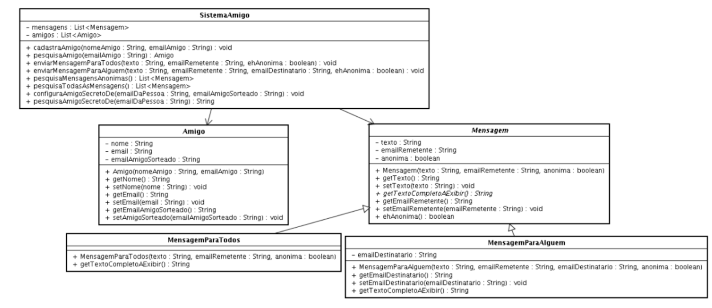

Disciplina: POO - Profa. Ayla Dantas Rebouças – Exercício 1

Considere um Sistema responsável pelo controle de uma brincadeira de Amigo Secreto e cujo diagrama de classes está  mostrado na figura abaixo. A partir desse sistema se pode cadastrar os participantes da brincadeira (cadastraAmigo),  pesquisar um dos participantes (pesquisaAmigo), configurar o amigo secreto de um certo participante após o sorteio  (configuraAmigoSecretoDe), enviar mensagens (anônimas ou não e que podem ir para todos os participantes ou para um  participante em particular).

A classe principal desse sistema e que oferece as suas funcionalidades principais é a classe SistemaAmigo, que guarda a  lista de amigos participantes da brincadeira e também as mensagens trocadas entre os participantes. Mensagem é uma  classe abstrata e que apresenta apenas um método abstrato getTextoCompletoAExibir(), além de outros métodos  concretos mostrados no diagrama. MensagemParaTodos e MensagemParaAlguem são subclasses de Mensagem e cada  uma apresenta uma implementação própria do método abstrato.  
Cada mensagem pode ser anônima ou não dependendo do valor da variável booleana “anonima” passada no seu construtor.  Na classe MensagemParaAlguem o método getTextoCompletoAExibir retorna uma mensagem no estilo “Mensagem  para fulano@email.com. Texto: Texto da mensagem” ou “Mensagem de: sicrano@email.com para fulano@email.com. Texto:  Texto da mensagem” caso a mensagem não seja anônima. Na classe MensagemParaTodos este método retorna uma  mensagem no estilo “Mensagem para todos. Texto: Texto da mensagem” ou “Mensagem de sicrano@email.com para todos.  Texto: Texto da mensagem” caso a mensagem não seja anônima.

1. Forneça o código para as classes “Mensagem” e “MensagemParaAlguem”. Observe o formato do texto da mensagem  conforme exemplo acima.
2. Forneça o código para os seguintes métodos da classe “SistemaAmigo”:
   public List<Mensagem> pesquisaMensagensAnonimas(){ {…}
   //Método que pesquisa as mensagens que são anônimas e retorna uma lista com tais mensagens.  
   public void configuraAmigoSecretoDe(String emailDaPessoa, String emailAmigoSorteado) throws AmigoInexistenteException{…} // Método que configura o amigo secreto sorteado para a pessoa cujo e-mail é “emailDaPessoa”, atribuindo-lhe seu  // amigo secreto como sendo a pessoa de e-mail “emailAmigoSorteado”. Caso não exista pessoa cadastrada no sistema  // com o e-mail “emailDaPessoa, deve ser lançada a exceção “AmigoInexistenteException”.
   public List<Mensagem> pesquisaTodasAsMensagens(){
   //Método que pesquisa todas as mensagens já enviadas.  
   public String pesquisaAmigoSecretoDe(String emailDaPessoa) throws AmigoInexistenteException, AmigoNaoSorteadoException{…}
   // Método que pesquisa o e-mail do amigo secreto sorteado para a pessoa cujo e-mail é “emailDaPessoa”  
   // Caso não exista pessoa cadastrada no sistema com o e-mail “emailDaPessoa”, deve ser lançada a exceção
   // “AmigoInexistenteException”. Caso exista a pessoa com esse e-mail, mas o seu amigo secreto sorteado
   // ainda não tenha sido configurado (o e-mail do amigo sorteado é null), deve ser lançada a exceção
   // “AmigoNaoSorteadoException”.

3. Crie uma classe TestaSistemaAmigo com um método “main” que execute os seguintes passos nesse sistema a partir da  classe SistemaAmigo:
   a) Cadastre dois amigos José e Maria com seus e-mails.
   b) Configure o amigo secreto de José como sendo Maria e o amigo secreto de Maria como sendo José. Obs: Lembre  de tratar a exceção que pode ser lançada.
   c) Envie uma mensagem anônima de Maria para José.
   d) Envie uma mensagem anônima de Maria para todos.
   e) Pesquise as mensagens anônimas e imprima o texto completo dessas mensagens através do método  getTextoCompletoAExibir.
   f) Pesquise o e-mail do amigo secreto de José e veja se é o e-mail de Maria, imprimindo “Ok” caso seja.
4. Crie uma outra classe TestaSistemaAmigoGUI com um método “main” que exercite a classe SistemaAmigo através dos seguintes passos:
   a) Inicialize a variável do tipo SistemaAmigo.
   b) Leia a quantidade total de amigos a participar da brincadeira  
   c) Leia os dados (nome e e-mail) de cada um dos amigos e os cadastre.
   d) Cadastre os resultados do sorteio dos amigos secretos (diga quem pegou quem).
   e) Envie uma mensagem de algum dos amigos para todos, coletando para isso os dados necessários (ex: remetente,  texto, se a mensagem é anônima ou não).
5. (OPCIONAL) Adicione na classe SistemaAmigo um método "sortear()" para realizar o sorteio dos amigos secretos  entre os participantes da brincadeira. Nesse método você pode usar uma lista auxiliar para ir guardando os amigos  ainda não sorteados. Para o sorteio em si, você pode usar o trecho de código:
   int posicaoDaListaSorteada = (int)(Math.random()*lista.size());
   Ao sortear a posição, o amigo dessa posição pode sair da lista dos ainda não sorteados.  
   Depois de criar esse método, lembre de alterar o main para chamá-lo e depois imprimir um relatório de quem tirou  quem na brincadeira.